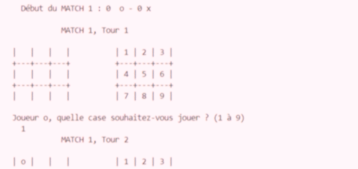

# TicTacToe-Project

*Développez une version en langage python uniquement du fameux Tic Tac Toe.*

Dans ce jeu, deux joueurs s'affrontent. À tour de rôle, ils désignent une case et
y insèrent alternativement un signe. Le premier joueur qui arrive à
faire un alignement vertical, horizontal ou diagonal de trois signes gagne la
partie. Si le plateau de jeu est rempli de signes et qu’il n’y a pas d'alignement
de trois, alors c’est un match nul.

---
<u>Compétences acquises :</u>
- 💻**Acquisition d'environnement de code** : Installer, découvrir et prendre en main un environnement d'édition de code (ici VScode).
- 🐍**Programmation en Python** : Maîtrise des bases du langage, telles que les boucles, les conditions, et l’utilisation des fonctions pour structurer le code.
- 🕹️**Gestion de l’interaction avec l'utilisateur** : Mise en place d’une interface en ligne de commande pour que deux joueurs puissent interagir avec le jeu.
- 🔣**Logique de jeu** : Implémentation de l'algorithme permettant de vérifier les conditions de victoire (alignement horizontal, vertical, ou diagonal) et de gérer les matchs nuls.
- 📊**Utilisation de structures de données** : Travail avec des listes (tableaux) pour représenter le plateau de jeu et manipuler les cases du jeu.

---
Participation :
- [*Jolyne Mangeot*](https://github.com/joseph-mangeot)
- [*Vladimir Gorbachev*](https://github.com/vladimir-gorbachev)
- [*Armelle Pouzioux*](https://github.com/armelle-pouzioux)
